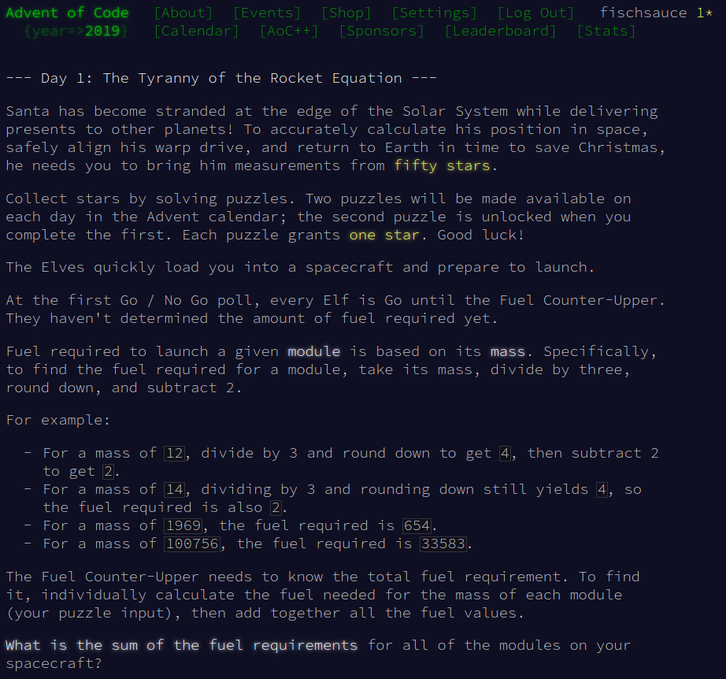
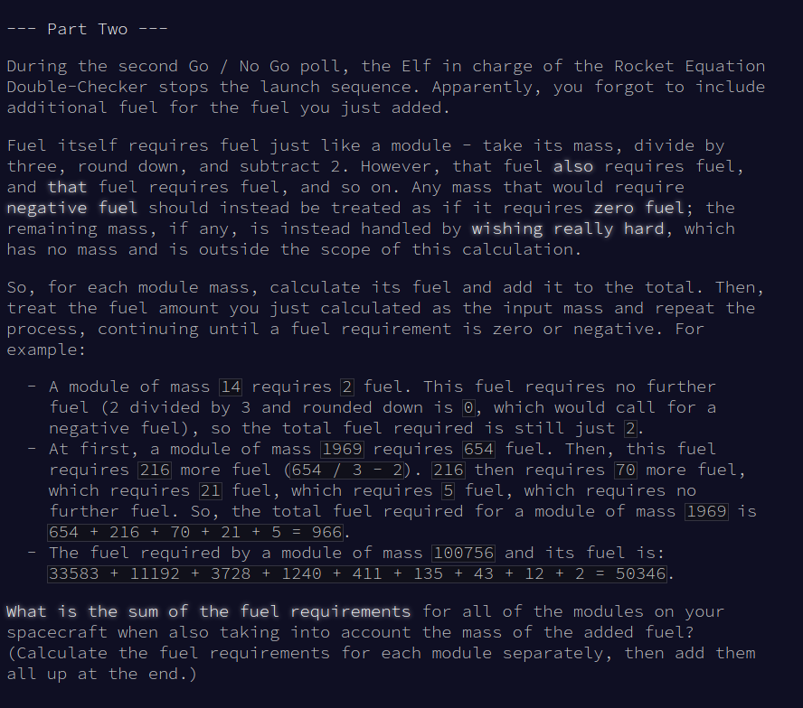

# my solutions for the 2019 'Advent of Code' challenges

https://adventofcode.com/2019

## Day 1:




``` 
# part 1
file = open("day1_data", "r")

modules = []
totalFuel = 0
fuelFuel = 0

for i in file:
    values = i.split()
    modules.append((int(values[0]) / 3) -2)

totalFuel += sum(modules)
print(totalFuel)  correct

# part 2:
while sum(modules) > 0:
    for i, n in enumerate (modules):
        fuelFuel = max(0, (int(n / 3) -2))
        modules[i] = fuelFuel
        totalFuel += max(0, fuelFuel)
        print(totalFuel) 
```
