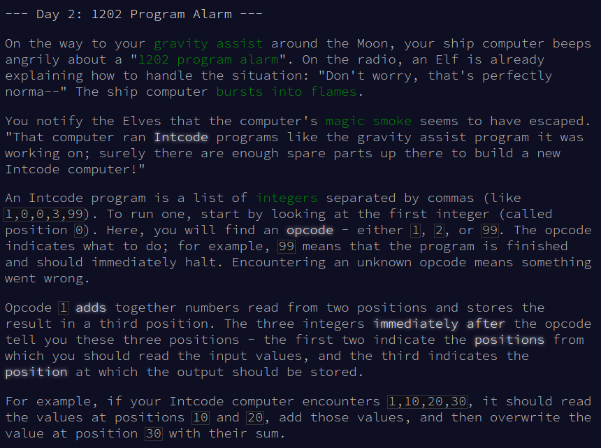
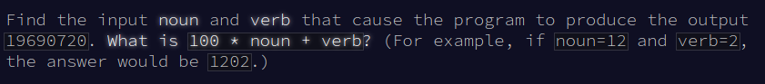

# my solutions for the 2019 'Advent of Code' challenges

https://adventofcode.com/2019

## Day 1:


 
### part 1
```
file = open("day1_data", "r")

modules = []
totalFuel = 0
fuelFuel = 0

for i in file:
    values = i.split()
    modules.append((int(values[0]) / 3) -2)

totalFuel += sum(modules)
print(totalFuel)  correct
```

### part 2:
```
while sum(modules) > 0:
    for i, n in enumerate (modules):
        fuelFuel = max(0, (int(n / 3) -2))
        modules[i] = fuelFuel
        totalFuel += max(0, fuelFuel)
        print(totalFuel) 
```


## Day 2:




### Part 1

```
file = open("day2_data", "r")

for i in file:
    list = i.split(",")
    # print(list[3])

for i in range(0, len(list)):
    list[i] = int(list[i])

# Restore Gravity!
list[1] = 12
list[2] = 2

opcodes = list[0::4]
# print(opcodes)

def adding(i):
    x = (list[list[i + 1]] + list[list[i + 2]])
    list[list[i + 3]] = x
    # print(x)

def multiplying(i):
    x = (list[list[i + 1]] * list[list[i + 2]])
    list[list[i + 3]] = x
    # print(x)


for i, v in enumerate(opcodes):
    if v == 1:
        adding(i * 4)
    if v == 2:
        multiplying(i * 4)
    if v == 99:
        print(list[0])
        break
```
### Part 2:
```
file = open("day2_data", "r")

for i in file:
    list = i.split(",")
    # print(list[3])

for i in range(0, len(list)):
    list[i] = int(list[i])


opcodes = list[0::4]
# print(opcodes)

def adding(i, list):
    x = (list[list[i + 1]] + list[list[i + 2]])
    list[list[i + 3]] = x
    # print(x)

def multiplying(i, list):
    x = (list[list[i + 1]] * list[list[i + 2]])
    list[list[i + 3]] = x
    # print(x)

noun = 0
verb = 0

def find(noun, verb):
    file = open("day2_data", "r")

    for i in file:
        list = i.split(",")
        # print(list[3])

    for i in range(0, len(list)):
        list[i] = int(list[i])

    list[1] = noun
    list[2] = verb

    for i, v in enumerate(opcodes):
        if v == 1:
            adding((i * 4), list)
            # x = (list[list[(i * 4) + 1]] + list[list[(i * 4) + 2]])
            # list[list[(i * 4) + 3]] = x
        if v == 2:
            multiplying((i * 4), list)
            # x = (list[list[(i * 4) + 1]] * list[list[(i * 4) + 2]])
            # list[list[(i * 4) + 3]] = x
        if v == 99:
            if list[0] == 19690720:
                print("noun = ", noun, "verb = ", verb)
            break

for i in range(len(list)):
    for j in range(len(list)):
        find(i, j)
```


